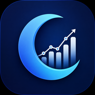
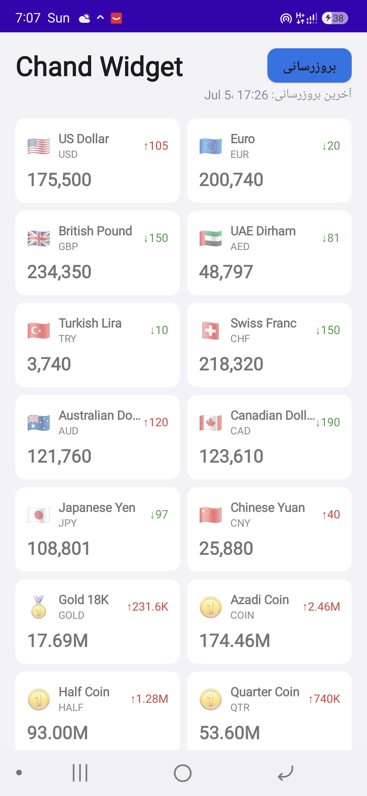
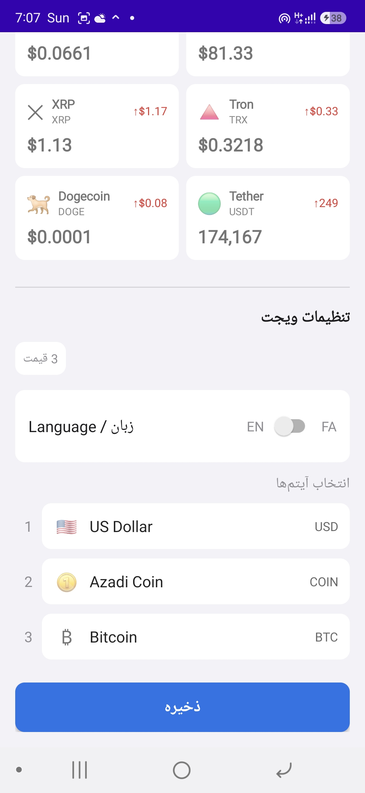
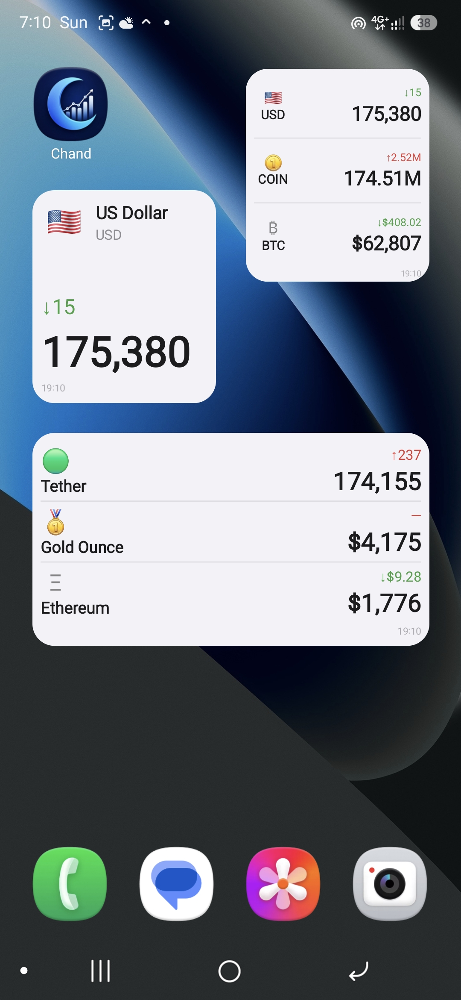

# چند؟!

### ویجت قیمت بازار ایران برای اندروید و ویندوز

نمایش لحظه‌ای قیمت‌های بازار ایران روی صفحه اصلی گوشی و دسک تاپ

الهام گرفته از اپ **Chand** برای iOS

 

---

## ✨ ویجت‌های اندروید

### 🔹 ویجت 2×2 تک‌نماد

نمایش یک نماد با فونت بزرگ و خوانا؛ مناسب برای نمادهایی که همیشه باید در معرض دید باشند.

### 🔹 ویجت 2×2 سه‌ردیف

سه قیمت در قالبی فشرده همراه با آیکون، نماد اختصاری و تغییرات قیمت.

### 🔹 ویجت 4×2 سه‌ردیف

نمایش سه قیمت با فضای بیشتر، متن بزرگ‌تر و نام کامل نمادها.

## 🪟 نسخه‌ی ویندوز

### 🔹 کارت شناور سه‌ردیفه (Always-on-top)

از اونجایی که ویندوز ۱۱ دیگه سیستم ویجت آزاد مثل Android AppWidget نداره،
نسخه‌ی ویندوز به‌صورت یک **کارت شناور بدون کادر** پیاده‌سازی شده که:

* سه نماد دلخواه رو با آیکون، نماد اختصاری و تغییرات قیمت نشون می‌ده — دقیقاً معادل ویجت 2×2 سه‌ردیفِ اندروید.
* با موس قابل جابجاییه و موقعیتش بین اجراها ذخیره می‌شه.
* با کلیک روی کارت، پنجره‌ی اصلی برنامه (لیست کامل نمادها با قیمت لحظه‌ای + جستجو) باز می‌شه.
* از System Tray و منوی راست‌کلیک قابل کنترله (به‌روزرسانی، Always-on-top، اجرا هنگام روشن شدن ویندوز، خروج).
* از همون منبع داده و همون منطق فرمت‌بندی قیمت اندروید استفاده می‌کنه (پورت مستقیم registry/formatter/api).

سورس، دستورالعمل build گرفتن یک `.exe` مستقل، و جزئیات فنی بیشتر: [`windows/README.md`](windows/README.md)

> یک [GitHub Actions workflow](.github/workflows/windows-build.yml) هم هست که با هر push به `windows/` یا با هر تگ `windows-v*`، فایل `.exe` رو خودکار می‌سازه — نیازی به داشتن ویندوز برای build گرفتن نیست، از تب **Actions** (یا از **Releases** روی تگ‌ها) قابل دانلوده.

---

## 🚀 امکانات

* ✅ پشتیبانی از **۲۶ نماد**
* ✅ بروزرسانی خودکار هر **۳۰ دقیقه** (اندروید) / هر **۶۰ ثانیه** (ویندوز)
* ✅ بروزرسانی دستی با لمس ویجت
* ✅ پشتیبانی از زبان‌های **فارسی و انگلیسی**
* ✅ سازگار با **Dark Mode**
* ✅ نمایش افزایش و کاهش قیمت با رنگ‌های سبز و قرمز
* ✅ امکان استفاده از چند ویجت مستقل
* ✅ نمایش قیمت‌ها متناسب با نوع دارایی

---

## 📊 نمادهای پشتیبانی‌شده

| 💵 ارزها      | 🪙 طلا و سکه   | ₿ رمزارزها  |
| ------------- | -------------- | ----------- |
| دلار آمریکا   | طلا ۱۸ عیار    | بیت‌کوین    |
| یورو          | سکه بهار آزادی | اتریوم      |
| پوند انگلیس   | نیم سکه        | بایننس      |
| درهم امارات   | ربع سکه        | لایت‌کوین   |
| لیر ترکیه     | اونس طلا       | بیت‌کوین کش |
| فرانک سوئیس   |                | EOS         |
| دلار استرالیا |                | سولانا      |
| دلار کانادا   |                | دوج‌کوین    |
| ین ژاپن       |                | ریپل        |
| یوان چین      |                | ترون        |
|               |                | تتر         |

---

## 📈 قالب نمایش قیمت‌ها

| دسته      | واحد         | نمونه       |
| --------- | ------------ | ----------- |
| ارزها     | تومان        | `172,185`   |
| طلا و سکه | میلیون تومان | `17.07 م.ت` |
| رمزارزها  | دلار         | `$104,532`  |

---

## 🌐 منبع داده

شبکه اطلاع‌رسانی طلا، سکه و ارز

**tgju.org**

 

ساخته شده برای کاربران اندروید و ویندوز علاقه‌مند به پیگیری سریع بازارهای مالی ایران

